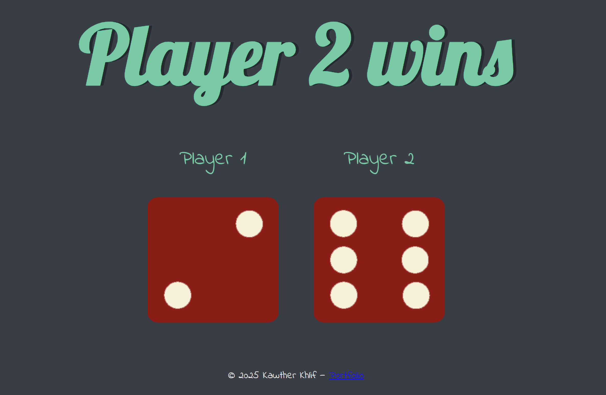

# 🎲 Dice Game

Un petit jeu de dés codé en HTML, CSS et JavaScript !

À chaque fois que tu rafraîchis la page, les dés sont lancés aléatoirement et un gagnant est affiché automatiquement selon les valeurs générées.

## 📸 Aperçu

 

## 🚀 Technologies utilisées

- HTML
- CSS
- JavaScript

## 🧠 Fonctionnalités

- Génère deux valeurs aléatoires pour simuler un lancer de dés.
- Affiche l'image correspondant à chaque valeur.
- Affiche dynamiquement le gagnant : Player 1, Player 2 ou Draw.

## 💻 Comment tester le projet

1. Clone le repo :
   ```bash
   git clone https://github.com/kawther27/dicee-game.git
